# Raw Signal — helicopter view

One page to orient anyone (human or agent) before touching the repo. Deep detail lives in
[architecture](architecture.md), [data ingestion](data-ingestion.md),
[data sources](data-sources.md), and the audit companion
[codebase audit 2026-08-28](codebase-audit-2026-08-28.md).

## What this is

A TCG market dashboard at **https://rawsignal.cards**: leaderboards, buy/sell signals,
metrics, and a buy list for raw singles (Pokémon, Riftbound) and sealed products
(Pokémon, Riftbound, One Piece, plus a curated "Obey Products" scalper feed). One
codebase produces three things: a **Cloudflare Worker** (the site + API + cron
ingestion), a set of **node sync scripts** (feed generation), and a **D1 database**
(authoritative catalog/history/signals in production).

## Repo map

```mermaid
flowchart TB
  subgraph frontend["Frontend (app/)"]
    pages["pages: page.tsx (Singles + shell) · SealedView · MetricsView · buylist · ProductDetailPage"]
    prims["shared UI: leaderboard/* · filters/* · MarketTabs · SignalControls · TopBar · MarketUI · HistoryPanel · PriceChart"]
    state["state/: market-query codec · market-memory · favorites"]
    dataL["data/: catalog-query engine · repositories · services · hooks"]
    domain["domain/: types · contracts · formatters · history-metrics · eras · pack-ev"]
    api["api/: catalog · history · metrics · set-ev · signals"]
    css["9 stylesheets, import-order dependent"]
  end
  subgraph backend["Worker + DB"]
    worker["worker/: index (fetch) · scheduled-ingestion (cron) · staging-jobs (ops) · live-feeds"]
    db["db/: schema · repository · ingestion modules · backfill"]
    drizzle["drizzle/: migrations 0000-0006"]
  end
  subgraph pipeline["Feed pipeline (node)"]
    sync["sync-tcgcsv.mjs · sync-sealed.mjs (roots)"]
    scripts["scripts/: clients · normalize · validate · details · scalper · msrp · graded · cloudflare"]
    feeds["public/data/*.json (generated, last-good protected)"]
  end
  tests["tests/: 159 node + 4 Playwright — several pin raw source text"]
  docs["docs/: maintained + gate-enforced"]

  pages --> prims --> dataL --> domain
  pages --> state
  api --> db
  worker --> db
  db -. "wrong-way imports" .-> frontend
  db -. "imports .mjs" .-> scripts
  sync --> scripts --> feeds
  feeds --> dataL
```

## Route surfaces

| Route | Entry | Notes |
|---|---|---|
| `/` | `app/page.tsx` | App shell + Singles leaderboard; renders `SealedView` when `mode=sealed` (remounted via a revision key on market change) |
| `/metrics` | `app/metrics/page.tsx` → `MetricsView` | Movers, indexes, momentum, category/set leaderboards |
| `/buylist` | `app/buylist/page.tsx` | Favorites-driven list + fullscreen mode |
| `/cards/[id]`, `/sealed/[id]` | `ProductDetailPage` via `detail-route` + `data/load-detail` | Shared detail surface for both product kinds |
| `/api/*` | `app/api/**/route.ts` | catalog, catalog/detail, history, metrics, set-ev, signals — read D1 first, bundled feeds as fallback |

## Layering (intended vs actual)

Intended: `domain` ← `state`/`data` ← UI, with `db/` and `worker/` beside them.
Actual: `db/` imports **from** `app/` (types, but also `signal-utils`, `market-utils`,
and the catalog repositories) and **from** `scripts/*.mjs` (normalizers), because
ingestion reuses the app's pure logic. It works — one bundle — but it means the
"backend" cannot be reasoned about without the frontend tree. See the audit doc for
the full wrong-way edge list and the extraction options.

```mermaid
flowchart LR
  domain["core/domain (pure)"]
  state["app/state"]
  data["app/data"]
  ui["pages + shared UI"]
  apir["app/api routes"]
  dbl["db/"]
  wrk["worker/"]
  scr["scripts/*.mjs"]

  ui --> data --> domain
  ui --> state --> domain
  data --> state
  apir --> data
  apir --> dbl
  wrk --> dbl
  wrk --> apir
  dbl --> domain
  dbl -->|"signal-utils, market-utils, catalog repos"| data
  dbl -->|"normalize/*.mjs, peer-history.mjs"| scr
```

## Data lifecycle

```mermaid
flowchart LR
  src["TCGCSV + supplemental sources"]
  clients["core/clients (retrying HTTP)"]
  norm["core/normalize (pure)"]
  val["scripts/validate + last-good publish"]
  pub["public/data feeds (bundled into deploys)"]
  cron["production cron */2 — guard: one checkpointed batch when due"]
  d1[("D1: catalog · observations · signals · graded · metrics")]
  repos["repositories: D1 first, feed fallback"]
  engine["catalog-query engine (one impl for browser + server)"]
  uiEnd["UI + /api"]

  src --> clients --> norm --> val --> pub
  pub --> cron --> d1
  pub --> repos
  d1 --> repos --> engine --> uiEnd
```



Key invariants: a malformed refresh never replaces the last-good feed; an incomplete
D1 run is never readable as current; persisted signals become authoritative only after
the `history-signals` completion marker; missing values stay `null` all the way to
presentation.

## Environments

| | Dev | Staging | Production |
|---|---|---|---|
| Where | `localhost:3000` (vinext dev) | `raw-signal-staging` on workers.dev | `raw-signal` at rawsignal.cards |
| D1 | placeholder binding | `d2e550f5…` — **stale by design** | `af781f30…` — daily ingestion |
| Cron | none | none (kept cheap) | `*/2` guarded |
| Ops adapter | n/a | enabled (`ENVIRONMENT=staging`) | refuses |
| Secrets | none | job token | job token + graded API key (sole spender) |

Deploy = full gate → `scripts/cloudflare/prepare-deployment.mjs` (writes
`dist/server/wrangler.<env>.json`) → `npx wrangler deploy --config …`. The gate's
production build **wipes** `dist/`, so always regenerate the wrangler config after a
gate and before deploying. Production releases happen only on the user's explicit
word.

## Release gate

`npm run check` = production build + 159 node tests + lint + 4 Playwright journeys.
The dev server must be stopped first (Playwright owns port 3000). Several node tests
are **characterization tests that regex-match raw source files** (`rendered-html`,
`scalper-mode`, `css-architecture`, `maintainer-docs`, `cloudflare-cutover`) — moving
or renaming code they pin fails the gate until the pins are updated deliberately.

## Sharp edges (do not rediscover these)

- **Fonts are self-hosted** (`public/fonts/` + `app/styles/fonts.css`). Never
  `next/font/google`: the vinext loader bakes absolute local paths into builds.
- **CSS is import-order dependent** (order pinned by `tests/css-architecture.test.mjs`).
  Later sheets deliberately out-rank earlier ones; appending to `market-views.css`
  instead of the owning component sheet is how the override stack re-grows.
- vinext route-level `loading.tsx` is banned (renders a broken shell).
- `tcg-index.json` (repo root) is imported directly by `page.tsx`/`SealedView.tsx` —
  regenerating feeds changes app-visible totals without touching `app/`.
- Device preferences live in `localStorage` (`raw-signal-*` keys), never the URL.
- `research.mjs`, `cards.json` are quarantined legacy artifacts
  ([docs/legacy-artifacts.md](legacy-artifacts.md)); `app/chatgpt-auth.ts` is orphaned
  Sites-era code kept pending a rollback-value review.
- Windows dev: wrangler can crash in libuv teardown after succeeding — verify actual
  state before retrying; migrations need `echo y |`.

## Where to change what

| You want to… | Touch |
|---|---|
| Add/adjust a leaderboard column or row cell | the mode adapter in `page.tsx` / `SealedView.tsx` + `leaderboard/MarketRow` styles in `market-views.css` |
| Change filters | `CardFilters` / `SealedFilters` config + `filters/*` primitives |
| Change URL/state behavior | `app/state/market-query.ts` (codec) + `useMarketQueryState` |
| Change search/sort/facets | `core/catalog-query.ts` (one engine for browser + server) |
| Change signal scoring | `core/signal-utils.ts` (single implementation, used by UI **and** ingestion) |
| Change ingestion | `db/*-ingestion.ts` + `worker/scheduled-*` (cron) or `worker/staging-jobs.ts` (ops) |
| Add a migration | `drizzle/` — apply to BOTH D1s; bookmark production first |
| Change feed generation | `sync-*.mjs` + `core/normalize` + validators — never bypass last-good |
