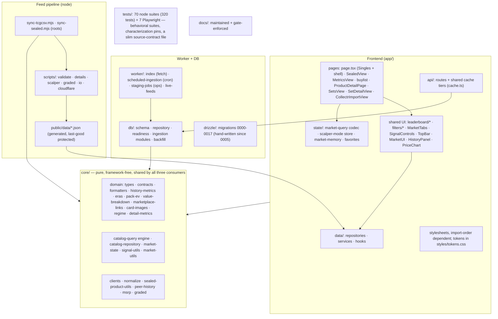
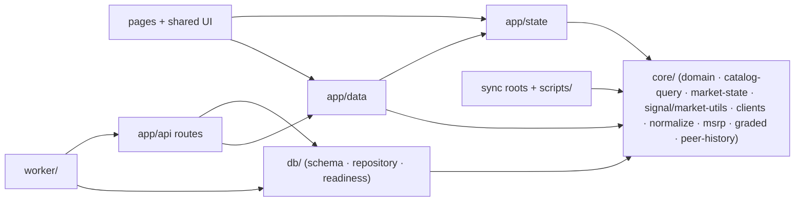
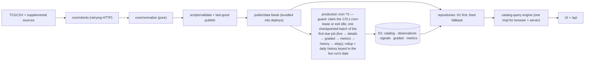

# Raw Signal — helicopter view

One page to orient anyone (human or agent) before touching the repo. Deep detail lives in
[architecture](architecture.md), [data ingestion](data-ingestion.md),
[data sources](data-sources.md), and the audit companion
[codebase audit 2026-08-28](codebase-audit-2026-08-28.md).

## What this is

A TCG market dashboard at **https://rawsignal.cards**: leaderboards, buy/sell signals,
metrics, and a buy list for raw singles (Pokémon, Riftbound) and sealed products
(Pokémon, Riftbound, One Piece, plus a curated "Obey Products" scalper feed). One
codebase produces three things: a **Cloudflare Worker** (the site + API + cron
ingestion), a set of **node sync scripts** (feed generation), and a **D1 database**
(authoritative catalog/history/signals in production).

## Repo map

## Route surfaces

| Route | Entry | Notes |
|---|---|---|
| `/` | `app/page.tsx` | App shell + Singles leaderboard; renders `SealedView` when `mode=sealed` (remounted via a revision key on market change) |
| `/metrics` | `app/metrics/page.tsx` → `MetricsView` | Movers, indexes, momentum, category/set leaderboards |
| `/buylist` | `app/buylist/page.tsx` | Favorites-driven list + fullscreen mode |
| `/cards/[id]`, `/sealed/[id]` | `ProductDetailPage` via `detail-route` + `data/load-detail` | Shared detail surface for both product kinds (eBay panel, marketplace buttons) |
| `/sets`, `/sets/[game]/[slug]` | `app/sets/page.tsx` → `SetsView`; `app/sets/[game]/[slug]/page.tsx` → `SetDetailView` | Sets directory with cover art; set detail with chase cards, related sealed, pack EV |
| `/import` | `app/import/page.tsx` → `CollectrImportView` | Collectr portfolio import (fetch via the `COLLECTR_FETCH` service binding) |
| `/sitemap.xml` | `app/sitemap.xml/route.ts` | Boards, sets directory, metrics, every set page (wave 15) |
| `/api/*` | `app/api/**/route.ts` | catalog, catalog/detail, history, history/batch (≤40 stored series, read-only), metrics, set-ev, signals, collectr — read D1 first, bundled feeds as fallback; deliberately no `/api/ebay/*` yet |

## Layering

The 2026-08 refactor extracted every module shared across consumers into `core/`
(pure TypeScript, no React/Worker/node imports). The old wrong-way edges — `db/`
importing from `app/`, ingestion importing `scripts/*.mjs` — are gone: `app/`,
`db/`+`worker/`, and the sync scripts all depend downward on `core/` and never on
each other. `app/state/market-query.ts` remains the URL codec but re-exports its
types from `core/market-state`; node scripts import core TS directly (Node 24
type-stripping — which is why every node-reachable relative import in `core/`
carries an explicit `.ts` extension).

## Data lifecycle

Key invariants: a malformed refresh never replaces the last-good feed; an incomplete
D1 run is never readable as current; persisted signals become authoritative only after
the `history-signals` completion marker; missing values stay `null` all the way to
presentation.

## Environments

| | Dev | Staging | Production |
|---|---|---|---|
| Where | `localhost:3000` (vinext dev) | `raw-signal-staging` on workers.dev | `raw-signal` at rawsignal.cards |
| D1 | placeholder binding | `d2e550f5…` — **stale by design** | `af781f30…` — daily ingestion |
| Cron | none | none (kept cheap) | `*/1` guarded |
| Ops adapter | n/a | enabled (`ENVIRONMENT=staging`) | refuses |
| Secrets | none | job token | job token + graded API key; optional `ALPHAVANTAGE_API_KEY` (S&P benchmark, skips when absent); `EBAY_CLIENT_ID`/`EBAY_CLIENT_SECRET` + var `EBAY_EPN_CAMPAIGN_ID` read by the eBay rotation — keyset pending from the user, so the action never fires yet |

Deploy = full gate → `scripts/cloudflare/prepare-deployment.mjs` (writes
`dist/server/wrangler.<env>.json`) → `npx wrangler deploy --config …`. The gate's
production build **wipes** `dist/`, so always regenerate the wrangler config after a
gate and before deploying. Production releases happen only on the user's explicit
word.

## Release gate

`npm run check` = production build + 320 node tests (70 suites) + lint + `tsc --noEmit` + 7
Playwright journeys. Playwright starts its own server on :4173, but vinext refuses to start a
second dev server for the same directory — **stop the :3000 dev server before the gate** or
`test:browser` fails with "Another vinext dev server is already running". A few suites still
**regex-match raw source files** (`source-contracts` — the slim successor to the old
`rendered-html` file, `scalper-mode`, `css-architecture`, `maintainer-docs`,
`cloudflare-cutover`) — moving or renaming code they pin fails the gate until the
pins are updated deliberately, and that is the point: each pin is an invariant only
source text can express.

## Sharp edges (do not rediscover these)

- **Fonts are self-hosted** (`public/fonts/` + `app/styles/fonts.css`). Never
  `next/font/google`: the vinext loader bakes absolute local paths into builds.
- **CSS is import-order dependent** (order pinned by `tests/css-architecture.test.mjs`).
  Later sheets deliberately out-rank earlier ones; appending to `market-views.css`
  instead of the owning component sheet is how the override stack re-grows.
- vinext route-level `loading.tsx` is banned (renders a broken shell).
- `tcg-index.json` (repo root) is imported directly by `page.tsx`/`SealedView.tsx` —
  regenerating feeds changes app-visible totals without touching `app/`.
- Device preferences live in `localStorage` (`raw-signal-*` keys), never the URL.
- `research.mjs` and `cards.json` (repo root) are quarantined-in-place legacy
  artifacts, and `legacy/chatgpt-auth.ts` is the parked Sites-era auth helper —
  none reachable from any build ([docs/legacy-artifacts.md](legacy-artifacts.md)).
- Windows dev: wrangler can crash in libuv teardown after succeeding — verify actual
  state before retrying; migrations need `echo y |`.
- **Migrations are hand-written** (`drizzle/00NN_name.sql`, contiguous numbering, applied
  by wrangler in filename order). drizzle-kit is retired (2026-09-03): its journal stopped
  at 0004 and the generator emitted wrong cumulative diffs, so the `db:generate` script,
  `drizzle.config.ts`, and the devDependency are gone; `drizzle/meta/` stays as history.
- `/api/history` warms its cache on a miss by fetching TCGplayer **and** re-deriving that
  product's metrics/signals (`persistDerivedHistory`). Against the local max-profile D1
  every hover does this (archive rows are `source='tcgcsv-archive'`, the route looks for
  `'tcgplayer'`), so the dev database drifts a little during `npm run check`.

## Where to change what

| You want to… | Touch |
|---|---|
| Add/adjust a leaderboard column or row cell | the mode adapter in `page.tsx` / `SealedView.tsx` + `leaderboard/MarketRow` styles in `market-views.css` |
| Change filters | `CardFilters` / `SealedFilters` config + `filters/*` primitives |
| Change URL/state behavior | `core/market-state` (types/defaults) + `app/state/market-query.ts` (codec) + `useMarketQueryState`; scalper persistence lives in `app/state/scalper-mode.ts` |
| Change API caching or readiness gating | `app/api/cache.ts` (shared Cache-Control tiers) + `db/readiness.ts` (run/marker gates) |
| Change search/sort/facets | `core/catalog-query.ts` (one engine for browser + server) |
| Change signal scoring | `core/signal-utils.ts` (single implementation, used by UI **and** ingestion) |
| Change ingestion | `db/*-ingestion.ts` + `worker/scheduled-*` (cron) or `worker/staging-jobs.ts` (ops) |
| Add a migration | `drizzle/` — apply to BOTH D1s; bookmark production first |
| Change feed generation | `sync-*.mjs` + `core/normalize` + validators — never bypass last-good |
| Change an outbound marketplace link or affiliate tag | `core/domain/marketplace-links.ts` (the only builder; TCGplayer Impact wrapper, eBay query rules, popover tiles) + the EPN Smart Links snippet in `app/layout.tsx` (pinned by `tests/source-contracts.test.mjs`); both footers carry the disclosure |
